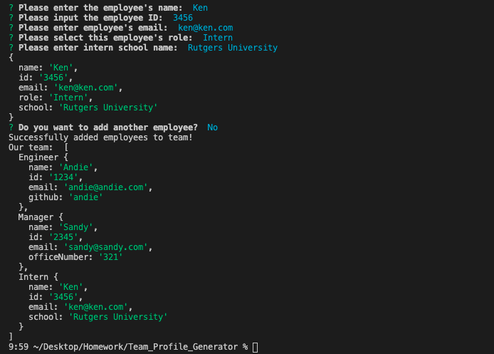
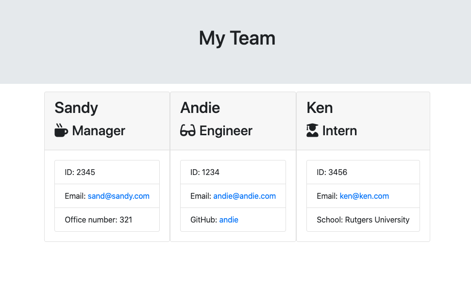

# Team_Profile_Generator

> A guided Node CLI to quickly build an engineering team webpage. 

THIS:  
  

  

PRODUCED THIS :sparkles::  

## Table of Contents
1. [About this project](#about)
2. [Languages Used](#laguages)
3. [Installation](#install)
4. [Usage](#usage)
5. [Contributing](#contribute)
6. [Acknowledgements](#ack)

## About This Project 

This project was constructed with npm inquirer. We propmt the user to input members of their engineering team: manager, engineers, and interns. Once all employee info has been entered, the app will generate and HTML file that displays a nicely formatted team roster based on the information provided.

## Languages & Technologies Used :floppy_disk: 

Powered by:
- node.js

## Installation :wrench: 

`npm install inquirer`  
`npm install jest`

## Usage :computer: 

`node app.js`

## Contributing :handshaking: 

Feel free to fork this repository, and open a pull request to suggest changes. 

## Acknowledgements 
- Inspo to use `when` in prompts: https://medium.com/javascript-in-plain-english/how-to-inquirer-js-c10a4e05ef1f
- Additional `when` reference: https://github.com/SBoudrias/Inquirer.js/blob/master/packages/inquirer/examples/when.js
- Inspo/reference on how to use `switch` in object creation based on role: https://github.com/RutgersCodingBootcamp/RUT-SOM-FSF-FT-07-2020-U-C/blob/master/11-express/01-Activities/03-Portfolio/server.js

Rutgers Coding Bootcamp, July 2020 :rocket: